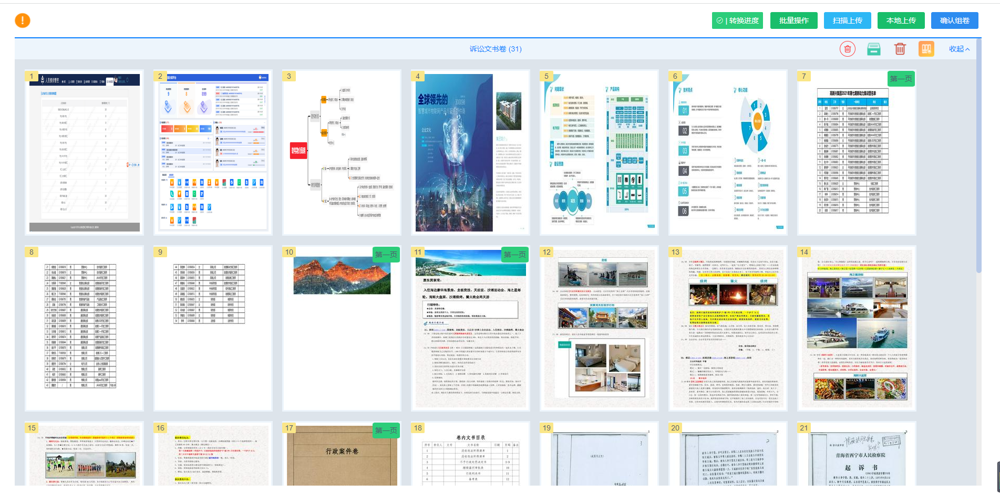
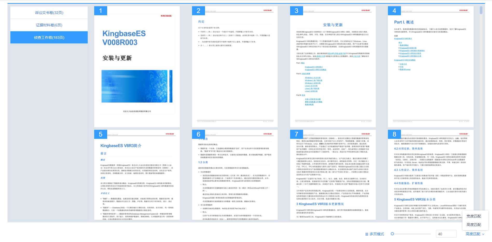

# 1.卷宗导入（含完成组卷）组件

### 1.1 概述

**卷宗导入功能：新增分卷、图片上传，PDF上传、批量删除、转换进度、PDF转换进度、图片（批量、单个）移动、图片（单个、批量）删除、图片排序、图片剪切、图片粘贴、图片旋转、确认组卷等功能**

**完成组卷功能：分卷切换预览、单页模式、双页模式、多页模式、宽高匹配、拖动缩放匹配等功能**

### 1.2 安装

```cmd
    npm i ims-proof-material
```
### 1.3 组件属性

**props**

|**属性**|**说明**|**必填**|**类型**|**默认值**|**最低版本**|
|:------|:------|:------|:--------|:--------|:--------|
|ajbh   |案件编号  |是 |String |    |1.0.8|
|dossierImportType   |类型  |是 |String |agzx  |1.0.8|
|bread   |我的待办案件  |否 |String |    |1.0.8|
|fjlx   |分卷类型  |否 |String |    |1.0.8|

```js
// 卷宗导入组件 dossierImportType：agzx(默认值)、zfkp
<DossierImport ajbh="1" dossierImportType="agzx"/>

```

**events**

|**事件名**|**说明**|**返回值**|**最低版本**|
|:------|:------|:------|:--------|:------|
|待定|  | | |    |


### 1.4 代码示例

> 全局引用：在main.js中配置证据材料组件引用


```js
    // main.js
    import {DossierImport} from 'ims-proof-material';
    Vue.use(DossierImport);
    
    // test.vue
    <DossierImport ajbh="1" dossierImportType="agzx"/>

```


> 局部引用：在引用模块中引用

```js
    // test.vue
    <template>
        <DossierImport ajbh="1" dossierImportType="agzx"/>
    </template>
    import {DossierImport} from 'ims-proof-material';
    export default {
        components:{
            DossierImport
        }
    }
```
### 1.5 组件截图



