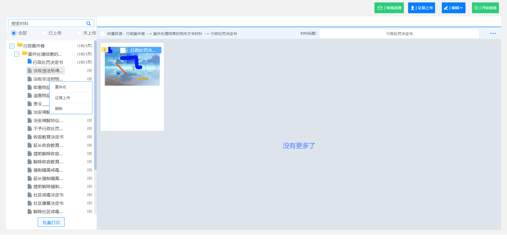

# 1.证据上传组件

### 1.1 概述

**功能：材料上传、数据同步、PDF转换进度、批量打印、重命名、图片排序、移动、删除、旋转、剪切、粘贴等**

### 1.2 安装

```cmd
    npm i ims-proof-material
```
### 1.3 组件属性

**props**

|**属性**|**说明**|**必填**|**类型**|**默认值**|**最低版本**|
|:------|:------|:------|:--------|:--------|:--------|
|ajbh   |案件编号  |是 |String |    |1.0.1|
|caseInfo   |案件信息  |是 |Object |    |1.0.7|
|proofMaterialType   |类型  |是 |String | agzx |1.0.7|
|isTransForm   |是否展示转换进度  |否 |Boolean |  true  |1.0.1|
|isEvidenceUpload   |是否展示证据上传  |否 |Boolean |  true  |1.0.1|
|isEdit   |是否展示编辑  |否 |Boolean |  true  |1.0.1|
|isDelete   |是否展示删除  |否 |Boolean |  true  |1.0.1|
|isRotate   |是否展示旋转  |否 |Boolean |  true  |1.0.1|
|isMove   |是否展示移除  |否 |Boolean |  true  |1.0.1|
|isSplit   |是否展示拆分  |否 |Boolean |  true  |1.0.1|
|isShear   |是否展示剪切  |否 |Boolean |  true  |1.0.1|

```js
    // 证据上传组件 caseInfo：案件所有信息，proofMaterialType: icp、agzx（默认值）
    <ProofMaterial ajbh="1" caseInfo="{}" proofMaterialType="agzx"/>

```

**events**

|**事件名**|**说明**|**返回值**|**最低版本**|
|:------|:------|:------|:--------|:------|
|ViewOriginalFile  |查看原文件 |文件信息|待更新|


### 1.4 代码示例

> 全局引用：在main.js中配置证据材料组件引用


```js
    // main.js
    import ProofMaterial from 'ims-proof-material';
    Vue.use(ProofMaterial);
    
    // test.vue
    <ProofMaterial ajbh="1" caseInfo="{}" proofMaterialType="agzx"/>

```


> 局部引用：在引用模块中引用

```js
    // test.vue
    <template>
        <ProofMaterial ajbh="1" caseInfo="{}" proofMaterialType="agzx"/>
    </template>
    import {ProofMaterial} from 'ims-proof-material';
    export default {
        components:{
            ProofMaterial
        }
    }
```
### 1.5 组件截图

