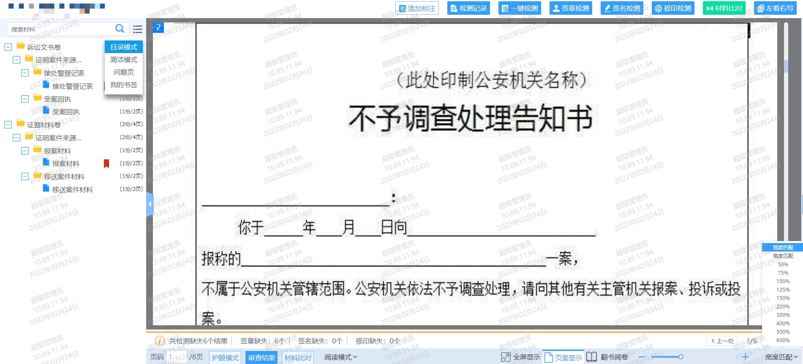

# 1.智能阅卷组件

### 1.1 概述

**功能：添加标注（框选、点击）、检测记录、一键检测（签章检测、捺印检测、签名检测）、审查结果、定位（目录树定位、页码定位、标注定位）、图片打印、图片旋转、添加书签、简洁模式、问题页、我的书签、目录树搜索、护眼模式、材料对比（双屏、四屏）、横向阅读、单页模式、多页模式、全屏显示、翻书阅卷模式、宽高多比例匹配，拖动缩放匹配等功能**

### 1.2 安装

```cmd
    npm i ims-proof-material
```
### 1.3 组件属性

**props**

|**属性**|**说明**|**必填**|**类型**|**默认值**|**最低版本**|
|:------|:------|:------|:--------|:--------|:--------|
|ajbh   |案件编号  |是 |String |    |1.0.7|
|ajmc   |案件名称  |是 |String |    |1.0.7|
|intelMarkingType   |类型  |是 |String|agzx|1.0.7|
|showAddCallouts   |添加标注  |否 |Boolean |true|1.0.9|
|showInspectionRecord   |检测记录  |否 |Boolean |true|1.0.9|
|showOneClickDetection   |一键检测  |否 |Boolean |true|1.0.9|
|showOtherDetection   |签名、签章、捺印检测  |否 |Boolean |true|1.0.9|
|showMaterialComparison   |材料比对  |否 |Boolean |true|1.0.9|
|showLookLeftAndWriteRight   |左看右写  |否 |Boolean |true|1.0.9|
|showRightMkList   |右侧标注列表  |否 |Boolean |true|1.0.9|
|showReviewResults   |审查结果  |否 |Boolean |true|1.0.9|
|showSplitScreenComparison   |分屏比对按钮  |否 |Boolean |true|1.0.9|
|showQuestionPage   |问题页  |否 |Boolean |true|1.0.9|
```js
    // 智能阅卷组件 intelMarkingType：agzx(默认值)、zfkp、icp
    <InterMark :ajbh="ajbh" :ajmc="ajmc" 
    :intelMarkingType="intelMarkingType" 
    :showInspectionRecord="showInspectionRecord"
    :showOneClickDetection="showOneClickDetection"
    :showOtherDetection="showOtherDetection"
    :showMaterialComparison="showMaterialComparison"
    :showLookLeftAndWriteRight="showLookLeftAndWriteRight"
    :showRightMkList="showRightMkList"
    :showReviewResults="showReviewResults"
    :showSplitScreenComparison="showSplitScreenComparison"
    :showQuestionPage="showQuestionPage"
    :showAddCallouts="showAddCallouts" />

```

**events**

|**事件名**|**说明**|**返回值**|**最低版本**|
|:------|:------|:------|:--------|:------|
|待定|  | | |    |


### 1.4 代码示例

> 全局引用：在main.js中配置证据材料组件引用


```js
    // main.js
    import {InterMark} from 'ims-proof-material';
    Vue.use(InterMark);
    
    // test.vue
    <InterMark :ajbh="ajbh" :ajmc="ajmc" 
    :intelMarkingType="intelMarkingType" 
    :showInspectionRecord="showInspectionRecord"
    :showOneClickDetection="showOneClickDetection"
    :showOtherDetection="showOtherDetection"
    :showMaterialComparison="showMaterialComparison"
    :showLookLeftAndWriteRight="showLookLeftAndWriteRight"
    :showRightMkList="showRightMkList"
    :showReviewResults="showReviewResults"
    :showSplitScreenComparison="showSplitScreenComparison"
    :showQuestionPage="showQuestionPage"
    :showAddCallouts="showAddCallouts" />

```


> 局部引用：在引用模块中引用

```js
    // test.vue
    <template>
        <InterMark :ajbh="ajbh" :ajmc="ajmc" 
        :intelMarkingType="intelMarkingType" 
        :showInspectionRecord="showInspectionRecord"
        :showOneClickDetection="showOneClickDetection"
        :showOtherDetection="showOtherDetection"
        :showMaterialComparison="showMaterialComparison"
        :showLookLeftAndWriteRight="showLookLeftAndWriteRight"
        :showRightMkList="showRightMkList"
        :showReviewResults="showReviewResults"
        :showSplitScreenComparison="showSplitScreenComparison"
        :showQuestionPage="showQuestionPage"
        :showAddCallouts="showAddCallouts" />
    </template>
    import {InterMark} from 'ims-proof-material';
    export default {
        components:{
            InterMark
        }
    }
```
### 1.5 组件截图

